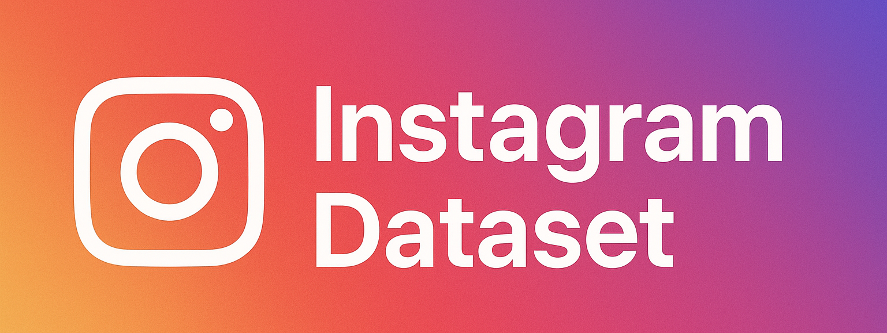

# Instagram Dataset

Analyze and extract valuable insights from Instagram data to understand audience behavior, engagement trends, and content performance.  

<p align="center">
  <a href="https://t.me/devpilot1" target="_blank">
    
  </a>
  <a href="https://discord.gg/vBu9huKBvy" target="_blank">
    
  </a>
  <a href="https://wa.me/447723343390?text=Hi%20Zeeshan%2C%20I%27m%20interested%20in%20automation." target="_blank">
    
  </a>
  <a href="mailto:support@appilot.app" target="_blank">
    
  </a>
</p>

<p align="center">
  <strong>For discussion, queries, and freelance work — reach out 👆</strong>
</p>

---

## Introduction
> This project helps marketers, data scientists, and developers work with large-scale Instagram datasets for research, analytics, and automation. It provides tools for data extraction, cleaning, visualization, and insight generation.

<p align="center">
  
</p>

### Key Benefits
1. Access structured user and post data.  
2. Enable AI/ML model training for social analytics.  
3. Generate insights for better marketing decisions.  

---

## Features
| Feature | Description |
|----------|-------------|
| Profile Data Collection | Extract usernames, bios, followers, and activity metrics. |
| Hashtag & Trend Analysis | Track popular hashtags and engagement trends. |
| Post Metadata | Capture likes, comments, timestamps, and captions. |
| Audience Insights | Analyze follower demographics and engagement rates. |
| Export Tools | Save data in CSV, JSON, or SQL formats. |

---

## Use Cases
- Marketing trend analysis  
- Influencer performance tracking  
- AI model training on social data  
- Audience segmentation for campaigns  

---

## FAQs

**Q:** What kind of data does an Instagram dataset include?  
**A:** An Instagram dataset typically includes user profiles, post details (captions, likes, comments), hashtags, engagement metrics, and timestamps. Some datasets also include follower graphs and sentiment data for analytics.  

**Q:** Where can I get an Instagram dataset?  
**A:** You can collect your own using Instagram’s API, web scraping tools, or download pre-built public datasets from sources like Kaggle, GitHub, or academic research repositories.  

**Q:** How can analyzing an Instagram dataset improve marketing?  
**A:** By studying patterns in engagement, hashtags, and audience behavior, businesses can optimize content strategies, predict trends, and increase ROI from their campaigns.  

---

## Results
----------------------------------- 
> 5x improved campaign targeting  
> 40% higher engagement using data-backed insights  
> Predictive content performance analytics  

## Performance Metrics
-----------------------------------
Average Performance Benchmarks:  
- **Data Accuracy:** 98% verified fields  
- **Collection Speed:** 1000 profiles/min  
- **Scalability:** 1M+ data points supported  
- **Format Support:** JSON, CSV, SQL  

---

## Do you have a customize project for us?
Contact Us  

<div align="center">
  <a href="https://mail.google.com/mail/u/?authuser=ahmadzee26@gmail.com">
    
    <code>support@appilot.app</code>
  </a>
  <span> ┃ </span>
  <a href="https://t.me/devpilot1">
    
    <code>pilot</code>
  </a>
  <span> ┃ </span>
  <a href="https://discord.com">
    
    <code>zee#2655</code>
  </a>
  <span> ┃ </span>
  <a href="https://wa.me/447723343390?text=Hi%20Zeeshan%2C%20I%27m%20interested%20in%20automation." target="_blank">
    
    <code>whatsapp</code>
  </a>
  <br />
</div>

---

## Installation

### Pre-requisites
- Python 3.8+  
- Git  
- Pandas, Requests libraries  

### Steps
```bash
# Clone the repo
git clone https://github.com/yourusername/instagram-dataset.git
cd instagram-dataset

# Install dependencies
pip install -r requirements.txt

# Setup environment
cp .env.example .env

# Run
python main.py

